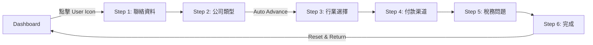

# Money Flow 💰

個人財務追蹤器，採用 Brutalist 設計風格，使用現代 Web 技術構建。

---

## 📖 目錄

- [關於本項目](#-關於本項目)
- [快速開始](#-快速開始)
- [項目結構](#-項目結構)
- [Onboarding 用戶流程](#-onboarding-用戶流程)
- [設計系統](#-設計系統)
- [配置指南](#-配置指南)
- [React Native 遷移指南](#-react-native-遷移指南)
- [Monorepo 結構 (Turborepo)](#-monorepo-結構-turborepo)

---

## 📖 關於本項目

### Tech Stack

- **React 18** + **TypeScript**
- **Vite** - Build tool
- **Tailwind CSS** - Styling
- **shadcn/ui** - UI Components
- **React Router DOM** - Routing
- **Lucide React** - Icons

### 主要功能

- 💰 餘額追蹤
- 📊 月度統計（收入/支出）
- 📱 響應式 Mobile-First 設計
- 🎨 Brutalist 設計風格
- 📝 6 步驟 Onboarding 流程

---

## 🚀 快速開始

### Prerequisites

- Node.js 18+
- npm 或 pnpm

### 本地開發

```bash
# Clone repository
git clone <repository-url>
cd money-flow

# Install dependencies
npm install

# Start dev server
npm run dev
```

### Build & Deploy

```bash
# Production build
npm run build

# Preview production build
npm run preview
```

---

## 🏗️ 項目結構

```
src/
├── assets/              # SVG 圖標資源
├── components/
│   ├── dashboard/       # Dashboard 組件
│   ├── layout/          # Layout 組件
│   ├── onboarding/      # Onboarding 組件
│   └── ui/              # shadcn/ui 組件
├── config/              # 配置文件（單一來源）
│   ├── app.ts           # App 元數據
│   ├── dashboard.ts     # Dashboard 配置
│   ├── onboarding.ts    # Onboarding 選項
│   └── theme.ts         # 設計 tokens
├── contexts/            # React Context
├── hooks/               # Custom Hooks
├── lib/                 # 工具函數
│   ├── utils.ts         # cn() 函數
│   └── storage.ts       # Storage 抽象層
├── pages/               # 頁面組件
└── types/               # TypeScript 類型
```

### Architecture Decisions

| 模式 | 說明 |
|------|------|
| **Barrel Exports** | 每個文件夾有 `index.ts`，簡化 imports |
| **Config-Driven UI** | 所有選項集中喺 `src/config/` |
| **Type Safety** | 所有數據有 TypeScript 類型 |
| **Platform Markers** | 每個文件有 `@platform` 標記（見遷移指南） |

---

## 📱 Onboarding 用戶流程

### 流程概覽

6 步驟 Typeform 風格流程，支援 auto-save 到 localStorage。



### 步驟詳細邏輯

| Step | 名稱 | Auto-Advance | Validation Rules | 組件 |
|------|------|:------------:|------------------|------|
| 1 | 聯絡資料 | ❌ | `name` + `email` (valid format) + `company` | `Step1ContactInfo` |
| 2 | 公司類型 | ✅ | 選擇任一選項即自動進入下一步 | `Step2EntityType` |
| 3 | 行業選擇 | ❌ | ≥1 個 sub-category 或 custom input | `Step3Industry` |
| 4 | 付款渠道 | ❌ | ≥1 個 bank 或 payment platform | `Step4PaymentChannels` |
| 5 | 稅務問題 | ❌ | 全部 toggle 有 default 值 | `Step5TaxQuestions` |
| 6 | 完成 | - | - | `Step6Completion` |

### Validation 邏輯（`use-onboarding.ts`）

```typescript
// Step 1: 聯絡資料
const isStep1Valid = contactName.trim() !== '' 
  && /^[^\s@]+@[^\s@]+\.[^\s@]+$/.test(email) 
  && companyName.trim() !== '';

// Step 3: 行業選擇
const isStep3Valid = industries.some(
  (ind) => ind.subCategories.length > 0 || ind.customInput
);

// Step 4: 付款渠道
const isStep4Valid = banks.length > 0 || paymentPlatforms.length > 0;
```

### 狀態管理

#### OnboardingContext

```typescript
interface OnboardingContextType {
  currentStep: number;
  formData: OnboardingFormData;
  isComplete: boolean;
  nextStep: () => void;
  prevStep: () => void;
  goToStep: (step: number) => void;
  updateFormData: (data: Partial<OnboardingFormData>) => void;
  completeOnboarding: () => void;
  resetOnboarding: () => void;
}
```

#### Form Data 結構

```typescript
interface OnboardingFormData {
  // Step 1
  contactName: string;
  email: string;
  companyName: string;
  
  // Step 2
  entityType: EntityType | null;
  
  // Step 3
  industries: IndustrySelection[];
  
  // Step 4
  banks: BankType[];
  paymentPlatforms: PaymentPlatform[];
  
  // Step 5
  hasOverseasClients: boolean;
  hasOfficeSpace: boolean;
  hasEmployees: boolean;
  hasInventory: boolean;
}
```

#### Auto-Save

進度自動儲存到 localStorage：
- Key: `onboarding_progress`
- 包含: `currentStep`, `formData`, `isComplete`

### 用戶行為邏輯

| 元素 | Step 1 行為 | Step 2-6 行為 |
|------|-------------|---------------|
| **Back Button** | 返回 Dashboard (`/`) | 返回上一步 |
| **Close Button** | 返回 Dashboard | 返回 Dashboard |
| **Next Button** | 進入 Step 2（需 validation） | 進入下一步 |

### 組件架構

```
Onboarding.tsx (Page)
└── OnboardingProvider (Context)
    └── OnboardingSteps (Step Router)
        └── Step1-6 Components
            └── OnboardingLayout (Wrapper)
                ├── Header
                │   ├── HeaderIconButton (Back)
                │   ├── ProgressBar
                │   └── HeaderIconButton (Close)
                ├── Content Area
                │   └── Step-specific UI
                └── Footer (Optional)
                    └── Next Button
```

### Step 3: 行業選擇特殊邏輯

1. 選擇主行業 → 打開 Bottom Sheet (Drawer)
2. 選擇 sub-categories 或輸入 "其他"
3. 點擊確認 → 關閉 Sheet，顯示選擇數量 badge
4. 支援多個主行業同時選擇

---

## 🎨 設計系統

### Colors (HSL)

定義喺 `src/index.css`：

```css
:root {
  --background: 45 100% 96%;      /* 米黃色背景 */
  --foreground: 0 0% 0%;          /* 黑色文字 */
  --primary: 45 100% 62%;         /* 金黃色 */
  --secondary: 45 100% 85%;       /* 淺黃色 */
  --accent: 330 100% 71%;         /* 粉紅色 */
}
```

### Typography

- **Display**: Space Grotesk（標題）
- **Body**: Inter（內文）

### Shadows & Borders (`src/config/theme.ts`)

```typescript
export const BORDERS = {
  standard: '3px',
  thick: '4px',
};

export const SHADOWS = {
  standard: '3px 3px 0px 0px rgba(0,0,0,1)',
  hover: '5px 5px 0px 0px rgba(0,0,0,1)',
  small: '2px 2px 0px 0px rgba(0,0,0,1)',
};
```

### Button System

`HeaderIconButton` 組件支援三種 size：

| Size | Dimensions | 使用場景 |
|------|------------|----------|
| `sm` | h-10 w-10 | 小型按鈕 |
| `md` | h-12 w-12 | Onboarding header |
| `lg` | h-14 w-14 | Dashboard header |

---

## ⚙️ 配置指南

### 修改 App 設定

`src/config/app.ts`:

```typescript
export const APP_CONFIG = {
  name: 'Money Flow',
  currency: 'HK$',  // 修改貨幣符號
  version: '1.0.0',
};
```

### 修改 Onboarding 選項

`src/config/onboarding.ts`:

```typescript
// 修改公司類型選項
export const ENTITY_TYPE_OPTIONS = [
  { id: 'limited', label: '有限公司', icon: Building2 },
  // 添加更多...
];

// 修改行業選項
export const INDUSTRY_WITH_SUBCATEGORIES = [
  {
    id: 'digital',
    label: '數碼創作',
    icon: Laptop,
    subCategories: ['YouTuber', 'KOL', ...],
  },
  // 添加更多...
];
```

### 修改 Dashboard 動作

`src/config/dashboard.ts`:

```typescript
export const DASHBOARD_ACTIONS = [
  { id: 'expense', label: '支出', icon: ArrowDownLeft },
  { id: 'income', label: '收入', icon: ArrowUpRight },
  // 添加更多...
];
```

---

## 🔄 React Native 遷移指南

### Platform Markers

每個文件頂部都有 `@platform` 標記：

| 標記 | 含義 | 轉換工作量 |
|------|------|-----------|
| `@platform: shared` | 100% 可共享 | 直接複製 |
| `@platform: adaptable` | 需要少量調整 | 改 import/API |
| `@platform: web` | 需要轉換 | UI 重寫 |

### 共享代碼（直接複製）

```
src/types/**           → packages/shared/types/
src/config/**          → packages/shared/config/
src/lib/utils.ts       → packages/shared/lib/
src/lib/storage.ts     → packages/shared/lib/ (需替換實現)
```

### 需要適配的代碼

```
src/contexts/**        → 檢查 storage import
src/hooks/**           → 檢查 Web-specific APIs
```

### 元素對照表

| Web (React) | Native (NativeWind) | 備註 |
|-------------|---------------------|------|
| `<div>` | `<View>` | 容器元素 |
| `<span>`, `<p>` | `<Text>` | 所有文字必須包在 Text 內 |
| `<button>` | `<Pressable>` | 或 `<TouchableOpacity>` |
| `` | `<Image>` | 需要 `source={{ uri: '...' }}` |
| `<input>` | `<TextInput>` | |
| `onClick` | `onPress` | |
| `onChange` | `onChangeText` | TextInput 專用 |
| `className` | `className` | NativeWind 支援！ |

### Tailwind 類別支援

#### ✅ 完全支援

```
flex, flex-row, flex-col, items-center, justify-between, gap-4
p-4, px-6, py-2, m-2, mx-auto, mt-8
w-full, h-12, w-14, min-h-screen
bg-primary, bg-background, text-foreground, border-border
rounded-xl, rounded-full, border-4, border-black
text-lg, font-semibold, text-center
```

#### ⚠️ 需要注意

| Web | Native 替代方案 |
|-----|-----------------|
| `hover:` | `active:` 或移除 |
| `shadow-[custom]` | 使用預設 shadow 或 StyleSheet |
| `cursor-pointer` | 移除（無意義） |
| CSS Grid | 使用 Flexbox |

#### ❌ 不支援

- `hover:*` 前綴（觸屏無 hover）
- 部分 CSS 屬性（如 `box-shadow` 自定義值）
- CSS Grid

### Storage 抽象層

已實現 `src/lib/storage.ts`：

```typescript
// Web 版本（現有）
export const storage = {
  getItem: (key: string) => localStorage.getItem(key),
  setItem: (key: string, value: string) => localStorage.setItem(key, value),
  removeItem: (key: string) => localStorage.removeItem(key),
};

// React Native 版本（需替換）
import AsyncStorage from '@react-native-async-storage/async-storage';

export const storage = {
  getItem: (key: string) => AsyncStorage.getItem(key),
  setItem: (key: string, value: string) => AsyncStorage.setItem(key, value),
  removeItem: (key: string) => AsyncStorage.removeItem(key),
};
```

### 路由對照

| Web (react-router-dom) | Native (expo-router) |
|------------------------|----------------------|
| `useNavigate()` | `useRouter()` |
| `navigate('/')` | `router.push('/')` |
| `navigate(-1)` | `router.back()` |
| `<Link to="/">` | `<Link href="/">` |
| `useParams()` | `useLocalSearchParams()` |

---

## 🏢 Monorepo 結構 (Turborepo)

### 目標目錄結構

```
money-flow/
├── apps/
│   ├── web/                 # 現有 React Web App
│   │   ├── src/
│   │   ├── package.json
│   │   └── vite.config.ts
│   └── native/              # 新 React Native App
│       ├── app/             # Expo Router pages
│       ├── src/
│       │   ├── components/  # Native UI 組件
│       │   └── screens/     # 對應 web/pages
│       ├── package.json
│       └── app.json
├── packages/
│   └── shared/              # 共享代碼
│       ├── types/
│       ├── config/
│       ├── lib/
│       ├── contexts/
│       ├── hooks/
│       └── package.json
├── package.json             # Root workspace
├── pnpm-workspace.yaml
└── turbo.json
```

### 設置步驟

#### 1. 初始化 Turborepo

```bash
npx @turbo/codemod create-turbo-config
```

#### 2. 配置 Workspace

`pnpm-workspace.yaml`:
```yaml
packages:
  - "apps/*"
  - "packages/*"
```

`turbo.json`:
```json
{
  "$schema": "https://turbo.build/schema.json",
  "globalDependencies": ["**/.env.*local"],
  "pipeline": {
    "build": {
      "dependsOn": ["^build"],
      "outputs": ["dist/**", ".next/**", "!.next/cache/**"]
    },
    "dev": {
      "cache": false,
      "persistent": true
    },
    "lint": {},
    "type-check": {}
  }
}
```

#### 3. 設置 Shared Package

`packages/shared/package.json`:
```json
{
  "name": "@money-flow/shared",
  "version": "0.0.0",
  "main": "./src/index.ts",
  "types": "./src/index.ts",
  "exports": {
    ".": "./src/index.ts",
    "./types": "./src/types/index.ts",
    "./config": "./src/config/index.ts",
    "./hooks": "./src/hooks/index.ts",
    "./contexts": "./src/contexts/index.ts",
    "./lib": "./src/lib/index.ts"
  }
}
```

#### 4. 引用 Shared Package

在 `apps/web/package.json` 和 `apps/native/package.json`:
```json
{
  "dependencies": {
    "@money-flow/shared": "workspace:*"
  }
}
```

### 搬遷清單

| 來源 | 目標 | 備註 |
|------|------|------|
| `src/types/*` | `packages/shared/types/` | 直接複製 |
| `src/config/*` | `packages/shared/config/` | 直接複製 |
| `src/lib/utils.ts` | `packages/shared/lib/` | 直接複製 |
| `src/lib/storage.ts` | `packages/shared/lib/` | 提供 Web/Native 兩個實現 |
| `src/contexts/*` | `packages/shared/contexts/` | 更新 storage import |
| `src/hooks/*` | `packages/shared/hooks/` | 檢查 Web APIs |

### React Native (Expo) 設置

```bash
cd apps
npx create-expo-app native --template blank-typescript
cd native
npx expo install nativewind tailwindcss
```

NativeWind 配置：`apps/native/tailwind.config.js`:
```javascript
module.exports = {
  content: [
    "./app/**/*.{js,jsx,ts,tsx}",
    "./src/**/*.{js,jsx,ts,tsx}",
    "../../packages/shared/**/*.{js,jsx,ts,tsx}"
  ],
  presets: [require("nativewind/preset")],
  theme: {
    extend: {
      // 複製 web 的 theme 配置
    }
  }
}
```

### 開發命令

```bash
# 全部 apps
pnpm dev

# 只跑 web
pnpm dev --filter=web

# 只跑 native
pnpm dev --filter=native

# Build 全部
pnpm build

# Type check
pnpm type-check
```

---

## 📚 資源連結

- [Lovable Docs](https://docs.lovable.dev/)
- [React](https://react.dev/)
- [Tailwind CSS](https://tailwindcss.com/)
- [shadcn/ui](https://ui.shadcn.com/)
- [NativeWind](https://www.nativewind.dev/)
- [Turborepo](https://turbo.build/)

---

## 📝 License

MIT
